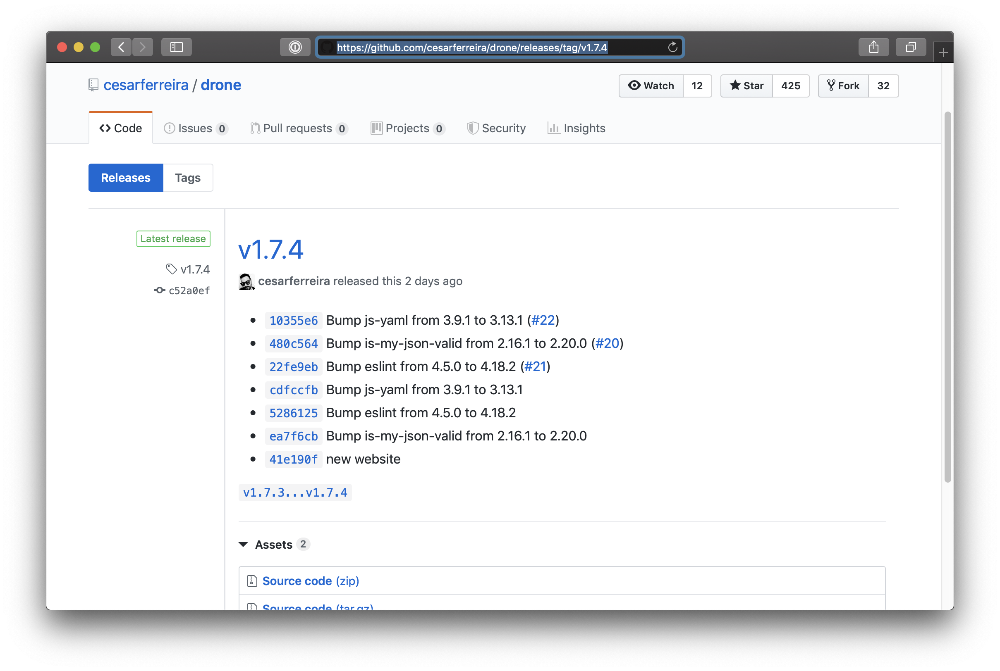
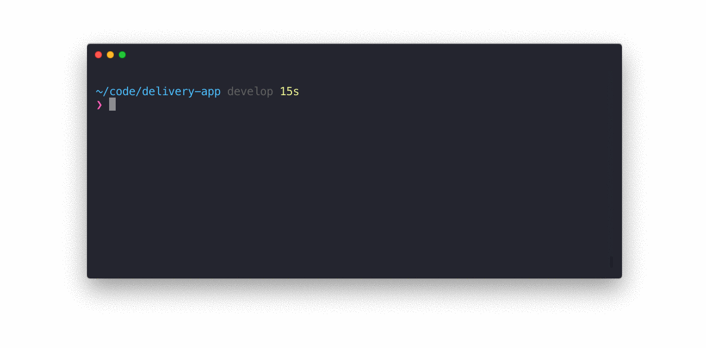

# Interactive git tag
[](https://travis-ci.org/cesarferreira/interactive-git-tag)
[](https://www.npmjs.com/package/interactive-git-tag)
[](https://www.npmjs.com/package/interactive-git-tag)


> Interactive tool that helps with your git tagging by suggesting versions


After it pushes the tag it opens a prefilled GitHub Releases draft with the list of commits since the previous tag.



## Install

```sh
$ npm install -g interactive-git-tag
```

## Usage

```
Usage

    $ tag <version>

    Version can be:
      patch | minor | major | prepatch | preminor | premajor | prerelease
 
 Examples

    $ tag
    $ tag patch
    $ tag major
    $ tag prepatch
    $ tag premajor
    $ tag prerelease
    
```

## Interactive UI

Run `tag` without arguments to launch the interactive UI that guides you through pushing a new tag.



## Shoutout

Inspired by the amazing [sindresorhus](https://github.com/sindresorhus)'s [np](https://github.com/sindresorhus/np) - A better `npm publish` tool

## Maintainers

- [Cesar Ferreira](http://cesarferreira.com)

## License

MIT