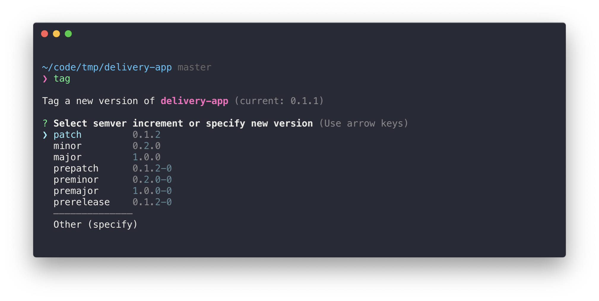

# git-tag-cli
> Tool that helps with your git tagging by suggesting names

<p align="center">
  
</p>

[](https://travis-ci.org/cesarferreira/git-tag-cli)
[](https://www.npmjs.com/package/git-tag-cli)
[](https://www.npmjs.com/package/git-tag-cli)

## Install

```sh
$ npm install -g git-tag-cli
```

## Usage

```
Usage

    $ tag <version>

    Version can be:
      patch | minor | major | prepatch | preminor | premajor | prerelease
 
 Examples

    $ tag
    $ tag patch
    $ tag major
    $ tag prepatch
    $ tag premajor
    $ tag prerelease
    
```

## Created by
[Cesar Ferreira](https://cesarferreira.com)

## License
MIT © [Cesar Ferreira](http://cesarferreira.com)
